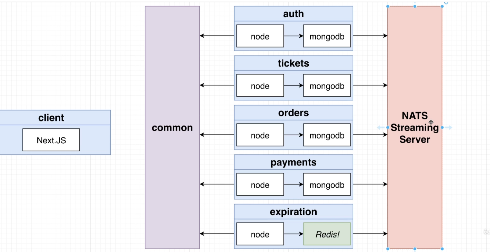
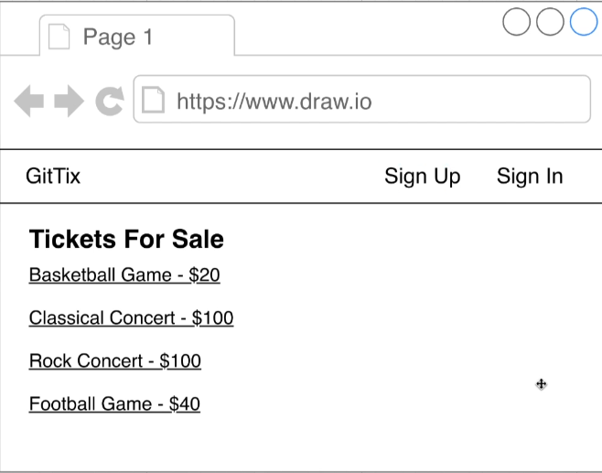
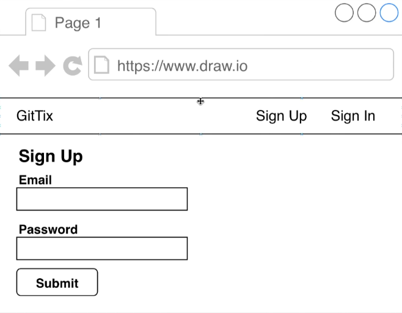
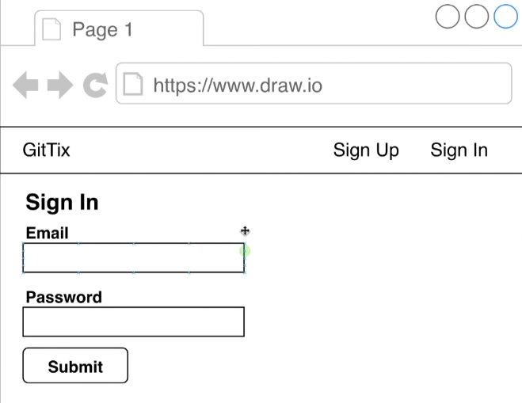
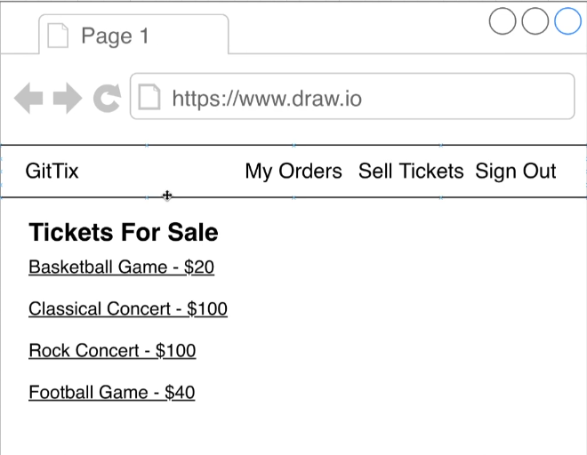
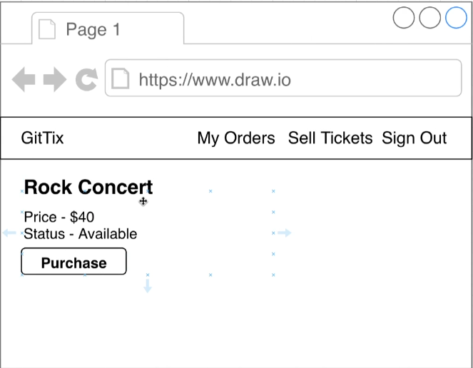
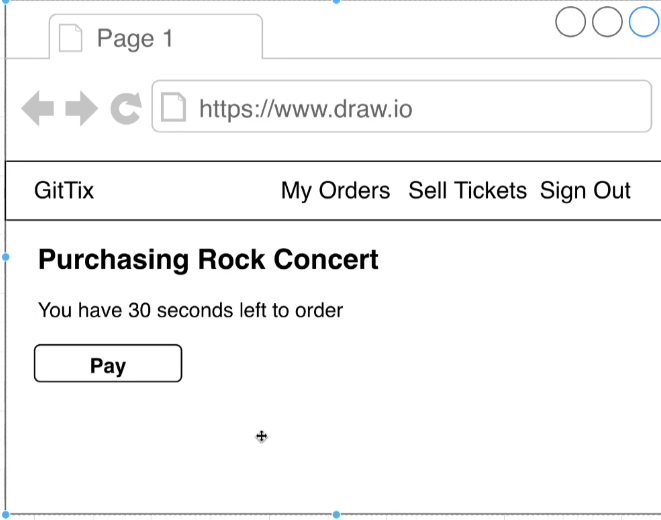
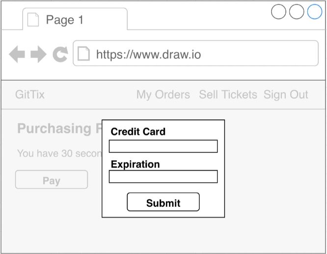

<h1 align="center"><a href="https://github.com/axyut/posting_app_microservice_nodejs">Ticket Booking App</a></h1>

  <p align="center">
    An Implementation of a Ticket Booking app as a microservice for each feature. Services communicate in Async Architecture. Use cases: Events, Concerts, Sport, Cinema hall
</p>

<!-- TABLE OF CONTENTS -->

## Table of Contents

-   [Table of Contents](#table-of-contents)
-   [About The Project](#about-the-project)
    -   [Built With](#built-with)
-   [Getting Started](#getting-started)
    -   [Prerequisites](#prerequisites)
    -   [Installation](#installation)
-   [without Skaffold](#without-skaffold)
-   [with Skaffold](#with-skaffold)
-   [Local Server](#local-server)
-   [Working](#working)

<!-- ABOUT THE PROJECT -->

## About The Project

Users can list a ticket for an event (concert, sports) for sale. Other users can purchase this event ticket. The user who is posting can buy his own ticket as well. When a user attempts to purchase a ticket, the ticket is "locked" for 15 minutes. The user has 15 minutes to enter their payment info. While locked no other users can pruchase that particular ticket. Ticket price can be edited if not locked. After 15 minutes, the ticket will either be unlocked or sold right after payment verification.

### Built With

This project is build with following languages and framework

-   [React](https://html.com)
-   [Express](https://developer.mozilla.org/en-US/docs/Web/CSS)
-   [Node](https://www.javascript.com/)
-   [Axios](https://www.javascript.com/)
-   [Concurrently](https://www.javascript.com/)
-   [Vite](https://www.javascript.com/)
-   [Docker](https://www.javascript.com/)

<!-- GETTING STARTED -->

## Getting Started

This is an example of how you may give instructions on setting up your project locally.
To get a local copy up and running follow these simple example steps. If this all is overwhelming you can try NOdockerNOkuber branch and follow the guidelines from that readme file.

### Prerequisites

-   Text editor
-   Docker
-   Kubernetes
-   minikube
-   skaffold

### Installation

1. Clone the repo to your machine

2. Make sure you're at master branch.

3. Move toward the Root directory .

```sh
   cd ticket_booking_app
```

## without Skaffold

4. Dockerize each service

```sh
   docker build . -t <username>/<servicename>
```

5. start minikube

```sh
   minikube start --driver=docker
```

6. Apply deployment configs

```sh
   cd /infra/k8s
   kubectl apply -f .
```

## with Skaffold

```
   minikube start --driver=docker --addons ingress
```

Start skaffold developemnt environment and track file changes automatically.

```sh
   skaffold dev
```

## Local Server

Visit http://<minikube_ip>:Nodeport/

```sh
   minikube ip  (shows minikube_ip)
   kubectl get svc (shows Nodeport of posts-srv)
```

<!--Working-->

## Working

1.  [Go to Website]()

Overview of how the services interact with eachother.

<p> </p>

<p style="display:flex;" >







</p>

2.  Post any ticket

3.  Buy any ticket

<!--

starting with typescript
npm i typescript ts-node-dev express @types/express
-- tsc --init
-- npm script, start : ts-node-dev src/index.ts
-- setting up Dockerfile, .dockerignore
-- building docker image
-- setting up auth-depl with auth-srv
-- starting minikube
-- setting up skaffold.yaml in root
-- adding ingress controller   (minikube addons enable ingress)
-- setting up ingress-srv
-- editing hosts vim /etc/hosts

starting after long time
minikube start --driver=docker -p ticket --addons ingress

-->
<!--
######## Connecting with google cloud with skaffold


-->
